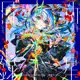
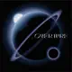

Hello 👋

I’m Tristan! I’m a French full-stack developer.

Want to know more about me? Take a look [right here](https://tritounet.fr)!

## 💼 Skills

## 📚 Learning

## 🎓 Education

**BUT Informatique – Full-Stack Development Option (3 years)**  
IUT of La Rochelle, France  
2022 – 2025

## 🎵 Currently Listening

My top tracks from Apple Music:

| # | Artwork | Track | Artist | Album |
|---|---------|-------|--------|-------|
| 1 |  | [Citrus Love](https://music.apple.com/fr/song/citrus-love/1643717858) | Bao The Whale · Overspace | Citrus Love - EP |
| 2 |  | [Rat A Tat](https://music.apple.com/fr/song/rat-a-tat/1627445790) | Midnight Grand Orchestra | Overture |
| 3 |  | [Caramel Pain](https://music.apple.com/fr/song/caramel-pain/1789078179) | Hoshimachi Suisei | SHINSEI MOKUROKU |
| 4 |  | [Never Ending Midnights](https://music.apple.com/fr/song/never-ending-midnights/1627445787) | Midnight Grand Orchestra | Overture |
| 5 |  | [魔性の女A](https://music.apple.com/fr/song/%E9%AD%94%E6%80%A7%E3%81%AE%E5%A5%B3a/1740692507) | Mulasaki Ima | 魔性の女A - Single |

---

*Last updated: August 5, 2025*

## Contact

  
   

